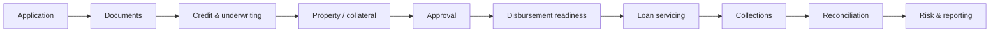

<div align="center">

# 🏦 MortgageOps

### Mortgage operations, credit, and financial control for mortgage institutions.

<p>


</p>

**A control-tower approach to the mortgage lifecycle.**

</div>

---

## 🧭 Product vision

MortgageOps is designed to help mortgage institutions manage the lifecycle of a mortgage from application through underwriting, property verification, approval, disbursement, servicing, collections, reconciliation, risk, and reporting.

The product is intended to sit alongside existing core banking and payment infrastructure rather than replace the entire banking stack in its first release.

<table>
<tr><td width="50%">

### 🧑‍💼 Case management
Applications, customer cases, documents, and workflow state.

### 📊 Underwriting
Credit and underwriting workflow with traceable decisions.

### 🏠 Collateral
Property and collateral records supporting approval and disbursement readiness.

</td><td width="50%">

### 💰 Financial control
Loan ledger, repayment schedules, reconciliation, and auditable financial history.

### 📈 Control tower
Management dashboards for operational and financial visibility.

### 🔐 Governance
Organization-aware access control, traceability, and safe correction patterns.

</td></tr>
</table>

## 🔄 Mortgage lifecycle



## ✅ Phase 1 foundation

- Product Requirements Document (PRD)
- Architecture specification
- Delivery roadmap
- Next.js / React / TypeScript application shell
- Mortgage control-tower dashboard prototype
- Application workflow state machine
- Money-domain primitives
- Initial Supabase PostgreSQL schema
- Organization-aware Row Level Security (RLS) policies
- Supabase browser client factory
- Workflow unit tests
- Continuous Integration (CI) for type-check, tests, and production build

<details>
<summary><strong>🎯 Minimum Viable Product (MVP) direction</strong></summary>

1. Application and customer case management
2. Document management
3. Credit and underwriting workflow
4. Property and collateral records
5. Approval workflows
6. Disbursement readiness
7. Loan ledger and repayment schedule
8. Payment reconciliation
9. Management dashboard

</details>

## 💰 Financial safety principle

Financial state must remain traceable. MortgageOps should preserve the history of decisions, approvals, documents, transactions, and workflow changes.

Corrections to posted financial state should be represented through compensating or reversing entries rather than silently overwriting history.

## 🏗️ Repository map

```text
app/                     application shell
docs/                    PRD, architecture, roadmap
lib/                     money, workflow, Supabase helpers
supabase/migrations/     database schema and policies
tests/                   workflow tests
.github/workflows/       continuous integration
```

## 🚀 Local development

Requirements: Node.js 22+ and npm.

```bash
npm install
npm run dev
npm run typecheck
npm test
npm run build
```

Copy `.env.example` to `.env.local` and provide the required Supabase values.

## 📌 Delivery tracking

Phase 1 implementation is tracked in GitHub Issue #1: **Phase 1: Build Mortgage Case Management Foundation**.

## 🔐 Ownership

MortgageOps is proprietary financial software and product documentation. See [`LICENSE`](./LICENSE) for usage terms.
